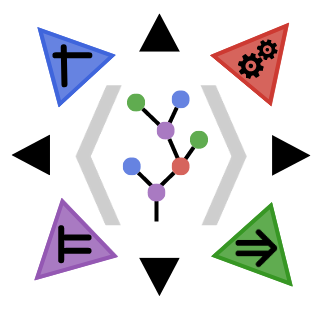

# SoleBase.jl
 <!-- - Base layer for [*Sole.jl*](https://github.com/aclai-lab/Sole.jl) -->

This package lays the foundations for [*Sole.jl*](https://github.com/aclai-lab/Sole.jl), an open-source framework for *symbolic machine learning*.

## About

The package is developed by the [ACLAI Lab](https://aclai.unife.it/en/) @ University of Ferrara.
